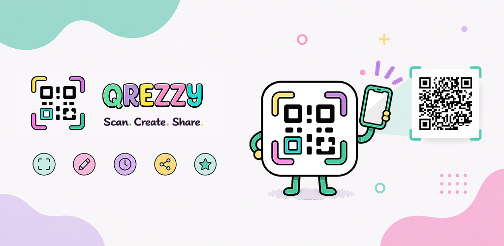
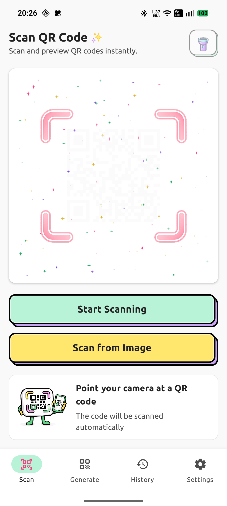
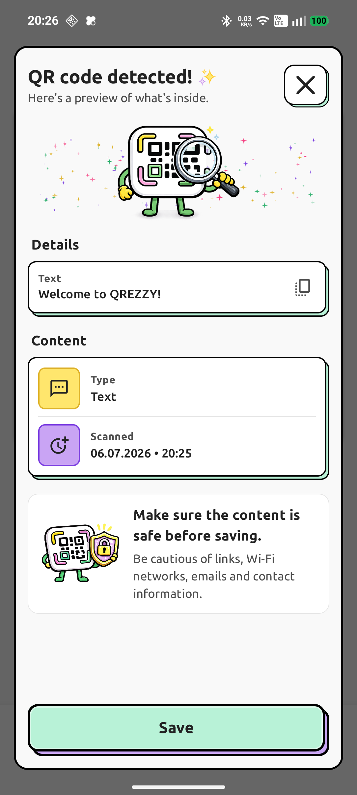
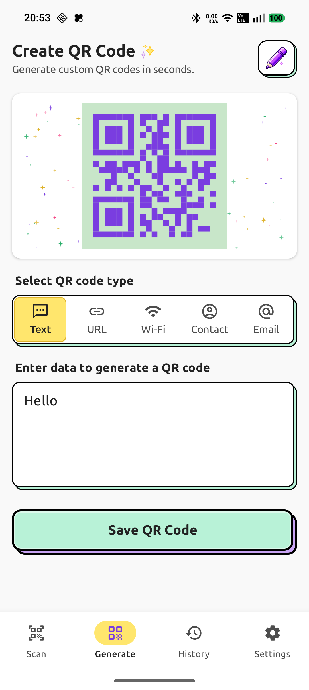
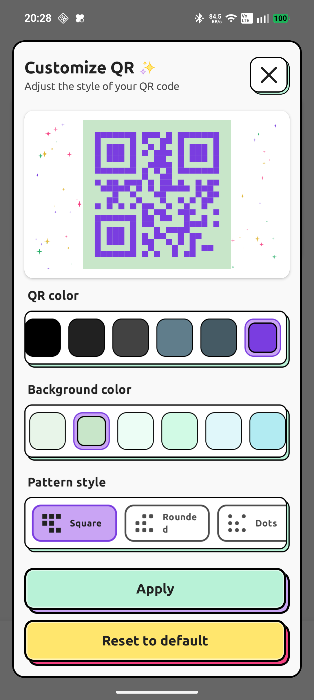
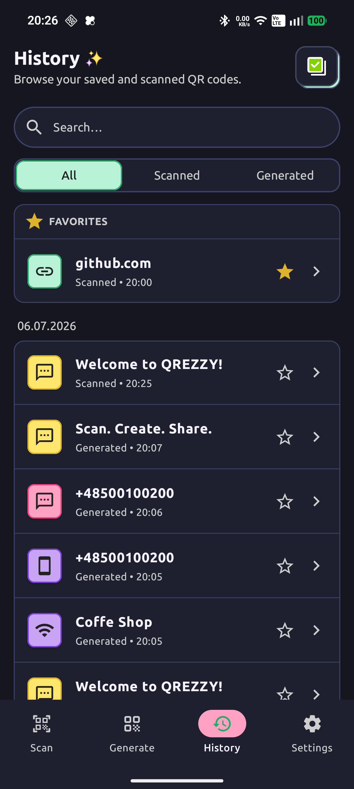
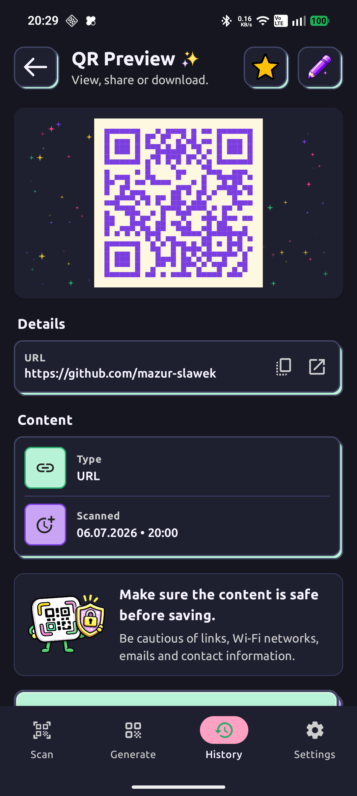
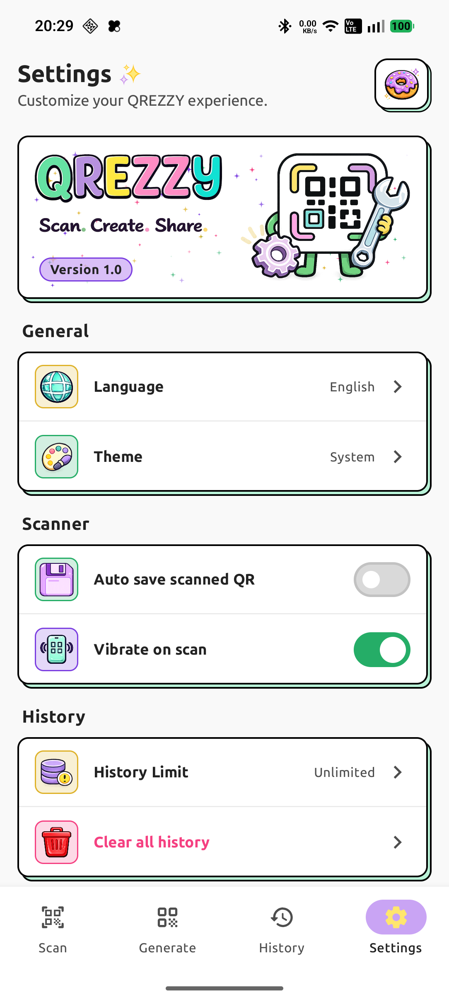

<p align="center">
  
</p>

<h1 align="center">QREZZY</h1>

<p align="center">
Modern QR scanner and generator for Android built with Kotlin and Jetpack Compose.
</p>

<p align="center">
Scan • Create • Share
</p>

<p align="center">


</p>

---

# 📱 Screenshots

| 📷 Scanner                                                            | 🔍 QR Detected                                                                    | 🎨 Generate                                                              |
|-----------------------------------------------------------------------|-----------------------------------------------------------------------------------|--------------------------------------------------------------------------|
|  |  |  |

| ✨ Customization                                                                   | 📚 History                                                         | 👁️ Preview QR                                                        | ⚙️ Settings                                                          |
|-----------------------------------------------------------------------------------|--------------------------------------------------------------------|-----------------------------------------------------------------------|----------------------------------------------------------------------|
|  |  |  |  |

---

# 📥 Download

You can try the latest version of QREZZY without building the project.

➡️ [Download APK](https://github.com/mazur-slawek/qr-scan-generator-android/releases/download/v1.0.1/QREZZY-v1.0.1.apk)


---

# ✨ Features

| 📷 Scanner                                                                                   | 🎨 Generator                                                                          | ✨ Customization                                      | 📚 History                                                                    | 👁️ Preview                                               | ⚙️ User Experience                                                               |
|----------------------------------------------------------------------------------------------|---------------------------------------------------------------------------------------|------------------------------------------------------|-------------------------------------------------------------------------------|-----------------------------------------------------------|----------------------------------------------------------------------------------|
| • Fast QR scanning<br>• CameraX powered<br>• Automatic detection<br>• Instant result preview | • Plain text • URL<br>• Wi-Fi • Contact<br>• Email • Location<br>• SMS • Phone number | • Custom colors<br>• Custom frames<br>• Live preview | • All / Scanned / Generated filters<br>• Multi-select deletion<br>• Favorites | • QR code preview<br>• Share QR code<br>• Download as PNG | • Material 3<br>• Light & Dark theme<br>• Offline support<br>• Smooth animations |

---

# 🛠 Tech Stack

| 💻 Language | 🎨 UI                                                     | 🏛 Architecture                                        | 💉 Dependency Injection | ⚡ Concurrency                                       | 📷 Camera |
|-------------|-----------------------------------------------------------|--------------------------------------------------------|-------------------------|-----------------------------------------------------|-----------|
| • Kotlin    | • Jetpack Compose<br>• Material 3<br>• Navigation Compose | • Clean Architecture<br>• MVVM<br>• Repository Pattern | • Hilt                  | • Kotlin Coroutines<br>• Kotlin Flow<br>• StateFlow | • CameraX |

| 🔍 QR Recognition                | 💾 Local Storage                           | ☁️ Firebase            | 🧪 Testing                                       | 🛠 Code Quality                        | 📦 Build                                |
|----------------------------------|--------------------------------------------|------------------------|--------------------------------------------------|----------------------------------------|-----------------------------------------|
| • Google ML Kit Barcode Scanning | • Room Database<br>• DataStore Preferences | • Firebase Crashlytics | • JUnit<br>• Mockito<br>• Kotlin Coroutines Test | • Detekt<br>• Ktlint<br>• EditorConfig | • Gradle Kotlin DSL<br>• GitHub Actions |

---

# 🏗 Architecture

The application follows **Clean Architecture** with a feature-oriented package structure.
<div align="center">

```text
┌─────────────────┐    ┌──────────────┐    ┌───────────────┐    ┌────────────────────────────────────────┐
│   Presentation  │    │    Domain    │    │      Data     │    │ Android Framework / External Libraries │
│ Compose         │───▶│ Use Cases    │───▶│ Repository    │───▶│ Room • CameraX • ML Kit • DataStore    │
│ ViewModels      │    │ Models       │    │ Mappers       │    │ Firebase • Coil                        │
└─────────────────┘    └──────────────┘    └───────────────┘    └────────────────────────────────────────┘
```

</div>

| 🖥 Presentation                                                                                    | 🧠 Domain                                                                    | 💾 Data                                                                                                            | 🧩 Core                                                                                      |
|----------------------------------------------------------------------------------------------------|------------------------------------------------------------------------------|--------------------------------------------------------------------------------------------------------------------|----------------------------------------------------------------------------------------------|
| • Jetpack Compose UI<br>• Navigation Compose<br>• ViewModels<br>• StateFlow<br>• UI State & Events | • Business rules<br>• Use Cases<br>• Domain models<br>• Repository contracts | • Repository implementations<br>• Room database<br>• CameraX integration<br>• ML Kit integration<br>• Data mappers | • Design System<br>• Reusable UI Components<br>• Theme<br>• Common utilities<br>• Extensions |

The **Domain** layer is completely independent of Android framework classes.

---

# 🎨 Design System

Built on **Material 3**, QREZZY combines a clean interface with a vibrant color palette to deliver a
modern Android experience.

| 🎨 Colors                       | 🌗 Themes                       | 💡 Principles                                                                        |
|---------------------------------|---------------------------------|--------------------------------------------------------------------------------------|
| 🟢 Mint<br>🩷 Pink<br>🟣 Purple | ☀️ Light Theme<br>🌙 Dark Theme | • Clean UI<br>• Consistent components<br>• Smooth animations<br>• Responsive layouts |

---

## 📂 Project Structure

```
app
│
├── core
│   ├── designsystem
│   ├── common
│   └── util
│
├── data
│   ├── database
│   ├── repository
│   └── mapper
│
├── domain
│   ├── model
│   ├── repository
│   └── usecase
│
├── feature
│   ├── splash
│   ├── home
│   ├── scanner
│   ├── generator
│   ├── history
│   └── settings
│
└── navigation
```

---

# 📚 Libraries

| Library                        | Used for                           |
|--------------------------------|------------------------------------|
| 🎨 **Jetpack Compose**         | Building the modern declarative UI |
| 🧩 **Material 3**              | Material Design components         |
| 🧭 **Navigation Compose**      | Screen navigation                  |
| 📷 **CameraX**                 | Camera integration                 |
| 🔍 **ML Kit Barcode Scanning** | QR code recognition                |
| 💾 **Room**                    | Local database                     |
| ⚙️ **DataStore**               | User preferences                   |
| 💉 **Hilt**                    | Dependency injection               |
| ⚡ **Kotlin Coroutines**        | Asynchronous programming           |
| 🌊 **Kotlin Flow**             | Reactive data streams              |
| 🧠 **ViewModel**               | UI state management                |
| ☁️ **Firebase Crashlytics**    | Crash reporting                    |
| 🖼️ **Coil**                   | Image loading                      |
| 🛠️ **Detekt**                 | Static code analysis               |
| ✨ **Ktlint**                   | Code formatting                    |

---

# 🔐 Permissions

QREZZY requests only the permission required for its core functionality.

| Permission | Purpose       |
|------------|---------------|
| 📷 Camera  | Scan QR codes |

### Notes

- 📷 Camera permission is requested **at runtime** only when QR code scanning starts.
- 🔒 All QR processing is performed locally on the device.
- 🚫 Images and videos are never stored or uploaded.
- 🛡️ QREZZY does not collect, store, or share personal data.

---

# 📴 Offline Support

QREZZY is designed to work **entirely offline**.

| Feature                 | Offline |
|-------------------------|:-------:|
| 📷 QR code scanning     |    ✅    |
| 🎨 QR code generation   |    ✅    |
| 📚 Scan history         |    ✅    |
| 📝 Generated QR history |    ✅    |
| ✨ QR customization      |    ✅    |

### Privacy First

- 🔒 All QR codes are processed entirely on-device.
- 🚫 Core QR scanning and generation work without an Internet connection.
- ☁️ QR code content is never transmitted to external servers.
- 🛡️ No personal data or QR code content is collected or shared.
- 🩺 Anonymous crash diagnostics are collected via Firebase Crashlytics to help improve app
  stability.
-

---

# 🧪 Testing

QREZZY currently includes **120+ unit tests** covering the application's core business logic.

| Tested Component    | Coverage |
|---------------------|----------|
| 🧠 Use Cases        | ✅        |
| 📱 ViewModels       | ✅        |
| 💾 Repository Logic | ✅        |
| 🔄 Mappers          | ✅        |
| 🛠 Utilities        | ✅        |

### Testing Stack

| Framework                | Purpose                      |
|--------------------------|------------------------------|
| 🧪 JUnit                 | Unit testing                 |
| 🎭 Mockito               | Mocking dependencies         |
| ⚡ Kotlin Coroutines Test | Testing coroutines and Flows |

### Run Tests

```bash
./gradlew testDebugUnitTest
```

---

# 🚀 Code Quality

QREZZY uses automated tooling to ensure consistent code style and maintainability.

| 🔍 Static Analysis | ✨ Formatting | ⚙️ Configuration |
|--------------------|--------------|------------------|
| Detekt             | Ktlint       | EditorConfig     |

### Available Commands

| Command                  | Description                      |
|--------------------------|----------------------------------|
| `./gradlew detekt`       | Run static code analysis         |
| `./gradlew ktlintCheck`  | Verify Kotlin formatting         |
| `./gradlew ktlintFormat` | Automatically format Kotlin code |

### Configuration Files

- `detekt.yml`
- `.editorconfig`

---

# ⚙️ Continuous Integration

Automated workflows ensure that every code change meets the project's quality standards.

| 🏗 Build      | 🧪 Tests   | 🔍 Static Analysis | ✨ Formatting |
|---------------|------------|--------------------|--------------|
| Project Build | Unit Tests | Detekt             | Ktlint       |

### GitHub Actions

- ✅ Runs on every Pull Request
- ✅ Runs on every push to `main`
- ✅ Prevents merging failing Pull Requests

---

# 📱 Requirements

| Requirement        | Version             |
|--------------------|---------------------|
| 💻 Android Studio  | Latest stable       |
| ☕ JDK              | 17                  |
| 📦 Android SDK     | 36                  |
| 📱 Minimum Android | Android 9 (API 28)  |
| 🚀 Target Android  | Android 16 (API 36) |

### Compatibility

- ✅ Supports Android 9 (API 28) and newer.
- 📷 Camera permission is required **only** for QR code scanning.
- 📴 Most features work entirely offline.

---

# 📈 Roadmap

| Feature                       | Status |
|-------------------------------|:------:|
| 📷 QR Scanner                 |   ✅    |
| 🎨 QR Generator               |   ✅    |
| 📚 Scan History               |   ✅    |
| 📝 Generated QR History       |   ✅    |
| 🎨 Material 3 UI              |   ✅    |
| 🌗 Light & Dark Theme         |   ✅    |
| 🧪 Unit Tests                 |   ✅    |
| ⚙️ GitHub Actions             |   ✅    |
| 🔥 Firebase Crashlytics       |   ✅    |
| ⭐ QR Favorites                |   ✅    |
| 📤 Export as PNG              |   ✅    |
| ✨ More QR Styles              |   🚧   |
| ☁️ Backup & Restore           |   🚧   |
| 📱 Home Screen Widgets        |   🚧   |
| ➕ Additional QR Content Types |   🚧   |

---

# 👨‍💻 Author

**Sławek Mazur**

Android Developer

📧 Email: <a href="mailto:slawek.mazur.software@gmail.com">slawek.mazur.software@gmail.com</a>

🌐 Portfolio: https://mazur.software

⭐ If you like this project, consider giving it a star!

---

## 📄 Copyright

© 2026 QREZZY. All rights reserved.

This repository is published for portfolio and educational purposes.

### Unauthorized redistribution or publication of this application under another name is prohibited.

<br><br>